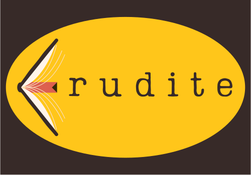

## ℹ️ About erudite
**erudite** is an end-to-end question-answering system that uses a catalog of open-source eBooks from Project Gutenberg as its knowledgebase. This system is designed to extract, transform and load (ETL) text into a vector database, enabling semantic search, and enriching search results with GPT, thereby allowing users to “ask the data.” 

The motivation for this project is to help my nephew read more books and with more intention by allowing interaction with text via a GPT agent.
